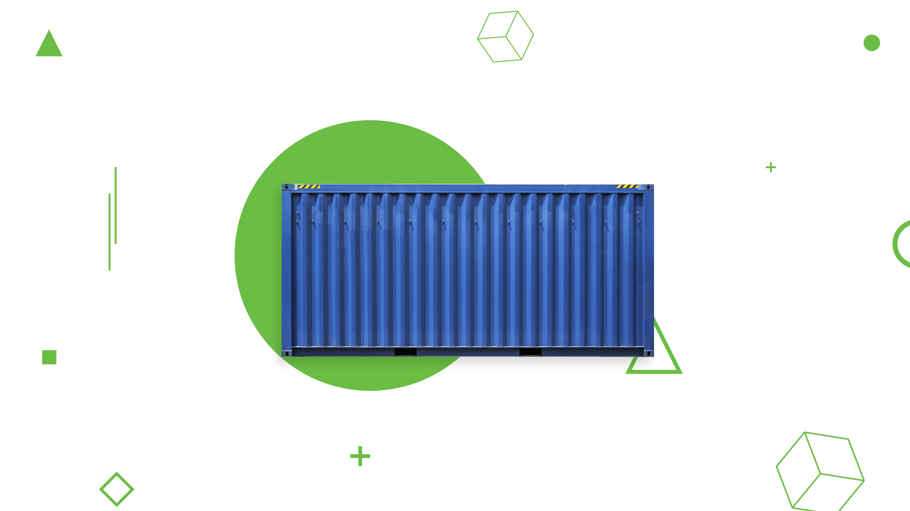
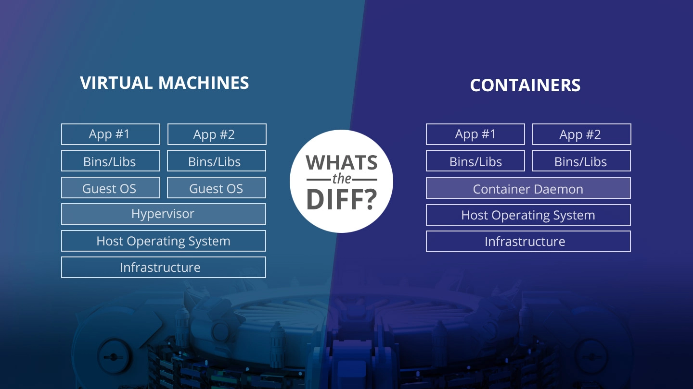

# Docker basics



## Docker là gì?
Docker là một công cụ ảo hóa lightweight mã nguồn mở , giúp tự động hóa triển khai application bên trong một container.

## Ảo hóa truyền thống (Virtual Machines) so sánh với Containers


## Vì sao lại dùng docker ?

- Docker lightweight và tối ưu hóa tài nguyên hơn VM
- Giả lập môi trường server ở dưới máy local (máy của developer)
- Thống nhất và chia sẻ môi trường lập trình cho nhóm làm việc
- Không tạo nhiều phần mềm rác trong máy, khi kết thúc dự án chỉ cần xóa bỏ container.

## Containers

Thành phần cơ bản của `Docker` là *containers*. Hãy thử chạy một container:

```
docker run hello-world
#or
docker run ubuntu /bin/echo 'Hello world'
```

Dễ phải không? Xem danh sách containers đang chạy nào!

```
docker ps
```

🤔 không có, hãy thêm tham số `-a` vào

```
docker ps -a
```

😀 Có thể xem thông tin chi tiết container với lệnh inspect như bên dưới

```
docker inspect <container-id>
```

Bây giờ hãy thử start một container từ images ubuntu:18.04

```
docker run ubuntu:18.04
```

(chỉ định version image (18.04) bằng tag name, sau dấu `:`)

🤔 Docker đang download file ảnh, rồi chẳng có gì hiện ra, để xem có container nào được tạo không...

```
docker ps -a
```

Container đã stop sau khi chạy? Hãy thêm tham số `-it`:

```
docker run -it ubuntu:18.04
```

Cool, Giờ chúng ta đã truy cập vào trong container!
* **-t** cờ để chỉ định chạy terminal bên trong container mới.
* **-i** cờ này giúp nhận lệnh từ standard input.
* **--rm** có thể thêm cờ này để tự động xóa container sau khi stop.

Để thoát, hãy dùng lệnh `exit`. Xem danh sách container lại một lần nữa:

```
docker ps -a
```

Mỗi container có một main process được gán `pid 1`, main process chạy khi container start, và khi main process dừng container sẽ chuyển sang trạng thái stoped, ngay cả khi có tiến trình khác đang chạy.

Giữ cho container chạy ngầm bằng tham số `-d`

```
docker run --name mycontainer -d ubuntu:18.04 /bin/sh -c "while true; do echo hello world; sleep 1; done"
```
* **-name** gán tên cho container.
* **-d** chạy ngầm.

## Images

_Images_ là templates mà docker sử dụng để tạo containers. Nếu hình dung bằng [Object Oriented Programming](https://en.wikipedia.org/wiki/Object-oriented_programming) thì images giống như _classes_ còn containers giống như _instances_.

Kiểm tra danh sách images ở local hiện tại:
```
docker images
```

Pull image từ [the public docker repository](https://hub.docker.com) về local repository. Việc này giống `git pull` từ public `git` repository.

```
docker pull mongo
```

Xóa images

```
docker rmi <image-id/image-name>
```

Tuyệt vời, hết phần basic rồi. Hãy chyển sang [phần kế tiếp](https://github.com/vfa-cancc/docker-workshop/tree/master/1-building-images).